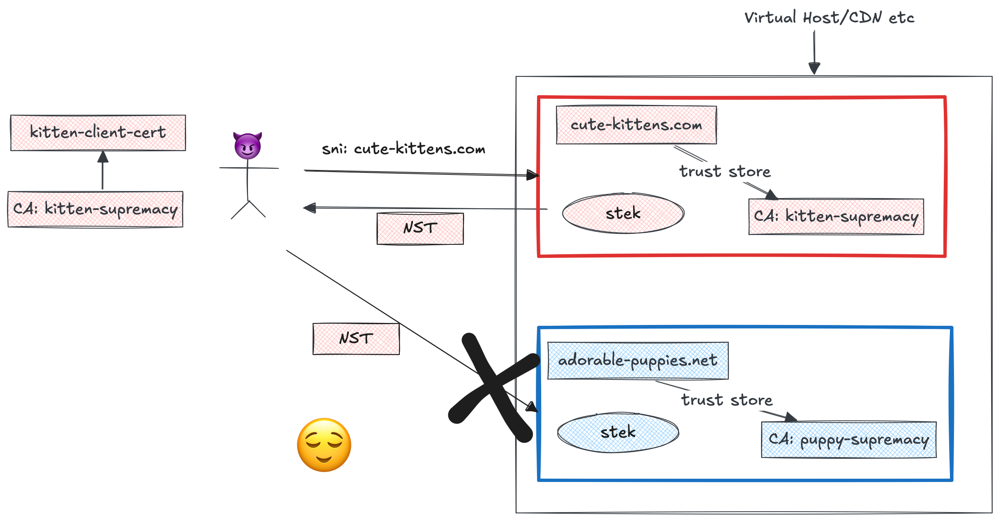
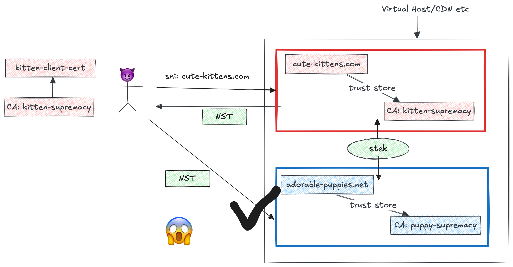

Session resumption introduces additional authentication materials (STEKs). If it's configured incorrectly, then this is a problem.

# mTLS & resumption -> 😌

Let's consider a case where some CDN is serving traffic is server private material for `cute-kittens.com` and `adorable-puppies.net`, and both of these have mTLS enabled. Someone should only be able to access `cute-kittens.com` if they have a cert issued by `kitten-supremacy`, and someone should only be able to access `adorable-puppies.net` if they have a cert issued by `puppy-supremacy`.

What _should_ happen, is that each trust boundary (puppy, kitten) has it's own STEK. This means that if an attacker attempts to resume with a domain that they previously authenticated with, then that resumption will fail.

# mTLS & resumption -> 

However, if the CDN just provisions a single STEK and shares that across trust domains, then problems ensure. An attacker can legitimately authenticate to a domain that they control to get access a session ticket. Then they can use that to "resume" to some other domain that they never authenticated against in the first place!

